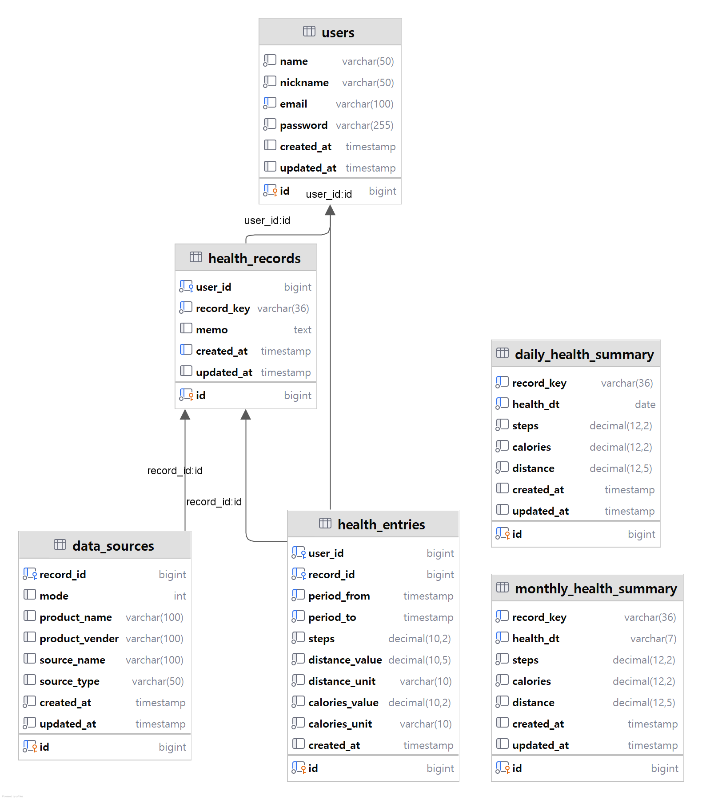

# Health Data Service

건강 데이터(걸음 수, 거리, 칼로리)를 시간대별로 저장하고, 일별/월별 집계를 제공하는 서비스입니다.

---

## 목차

1. [프로젝트 개요](#1-프로젝트-개요)
2. [데이터베이스 설계](#2-데이터베이스-설계)
3. [테이블 상세 설계](#3-테이블-상세-설계)
4. [관계 설명](#4-관계-설명)

---

## 1. 프로젝트 개요
### 1.1. 주요 기능

- Input Data 변환 및 저장
- 시간대별 건강 데이터 관리
- 일별/월별 집계 자동 생성
- 사용자 인증 (세션 기반)
- 전역 예외 처리

### 1.2. 기술 스택

- Java 17
- Spring Boot 3.x
- Spring Data JPA
- Spring Security
- MySQL 8.0

### 1.3. API 엔드포인트

**인증 (AuthController)**
- `POST /api/auth/signup` - 회원가입
- `POST /api/auth/login` - 로그인
- `POST /api/auth/logout` - 로그아웃
- `GET /api/auth/me` - 현재 사용자 조회

**건강 데이터 (HealthDataController)**
- `POST /api/health/load/{fileName}` - JSON 파일 데이터 로드
- `GET /api/health/entries` - 사용자별 건강 데이터 조회

**집계 데이터 (HealthSummaryController)**
- `GET /api/health/summary/daily/{recordKey}` - 일별 집계 조회
- `GET /api/health/summary/monthly/{recordKey}` - 월별 집계 조회

---

## 2. 데이터베이스 설계

### 2.1. ERD

### 2.2. 테이블 목록

| 번호 | 테이블명 | 설명 |
|------|---------|------|
| 1 | users | 사용자 정보 |
| 2 | health_records | 건강 기록 메인 |
| 3 | health_entries | 시간대별 건강 데이터 |
| 4 | data_sources | 데이터 소스 정보 |
| 5 | daily_health_summary | 일별 집계 |
| 6 | monthly_health_summary | 월별 집계 |

자세한 테이블 설계는 [DATABASE_DESIGN.md](docs/DATABASE_DESIGN.md)를 참고하세요.

---

## 3. 테이블 상세 설계

### 3.1. users (사용자)

| 컬럼명 | 데이터 타입 | NULL | 기본값 | 설명 |
|--------|------------|------|--------|------|
| id | BIGINT | NO | AUTO_INCREMENT | 사용자 ID (PK) |
| name | VARCHAR(50) | NO | - | 이름 |
| nickname | VARCHAR(50) | NO | - | 닉네임 |
| email | VARCHAR(100) | NO | - | 이메일 (로그인 ID) |
| password | VARCHAR(255) | NO | - | 암호화된 비밀번호 |
| created_at | TIMESTAMP | NO | CURRENT_TIMESTAMP | 생성 시간 |
| updated_at | TIMESTAMP | NO | CURRENT_TIMESTAMP | 수정 시간 |

**제약조건**
- PRIMARY KEY: `id`
- UNIQUE KEY: `email`

---

### 3.2. health_records (건강 기록)

| 컬럼명 | 데이터 타입 | NULL | 기본값 | 설명 |
|--------|------------|------|--------|------|
| id | BIGINT | NO | AUTO_INCREMENT | 레코드 ID (PK) |
| user_id | BIGINT | NO | - | 사용자 ID (FK) |
| record_key | VARCHAR(36) | NO | - | 레코드 고유 키 (UUID) |
| memo | TEXT | YES | NULL | 메모 |
| created_at | TIMESTAMP | NO | CURRENT_TIMESTAMP | 생성 시간 |
| updated_at | TIMESTAMP | NO | CURRENT_TIMESTAMP | 수정 시간 |

**제약조건**
- PRIMARY KEY: `id`
- FOREIGN KEY: `user_id` REFERENCES `users(id)` ON DELETE CASCADE
- UNIQUE KEY: `record_key`
- INDEX: `(user_id, created_at)`

---

### 3.3. health_entries (시간대별 건강 데이터)

| 컬럼명 | 데이터 타입 | NULL | 기본값 | 설명 |
|--------|------------|------|--------|------|
| id | BIGINT | NO | AUTO_INCREMENT | 엔트리 ID (PK) |
| user_id | BIGINT | NO | - | 사용자 ID (FK) |
| record_id | BIGINT | NO | - | 레코드 ID (FK) |
| period_from | TIMESTAMP | NO | - | 측정 시작 시간 |
| period_to | TIMESTAMP | NO | - | 측정 종료 시간 |
| steps | DECIMAL(10,2) | NO | - | 걸음 수 |
| distance_value | DECIMAL(10,5) | NO | - | 거리 값 |
| distance_unit | VARCHAR(10) | NO | 'km' | 거리 단위 |
| calories_value | DECIMAL(10,2) | NO | - | 칼로리 값 |
| calories_unit | VARCHAR(10) | NO | 'kcal' | 칼로리 단위 |
| created_at | TIMESTAMP | NO | CURRENT_TIMESTAMP | 생성 시간 |

**제약조건**
- PRIMARY KEY: `id`
- FOREIGN KEY: `user_id` REFERENCES `users(id)` ON DELETE CASCADE
- FOREIGN KEY: `record_id` REFERENCES `health_records(id)` ON DELETE CASCADE
- INDEX: `user_id`
- INDEX: `record_id`
- INDEX: `(user_id, period_from)` - 사용자별 시간 조회 최적화
- INDEX: `(period_from, period_to)`
- INDEX: `period_from`

---

### 3.4. data_sources (데이터 소스)

| 컬럼명 | 데이터 타입 | NULL | 기본값 | 설명 |
|--------|------------|------|--------|------|
| id | BIGINT | NO | AUTO_INCREMENT | 소스 ID (PK) |
| record_id | BIGINT | NO | - | 레코드 ID (FK) |
| mode | INT | YES | NULL | 데이터 수집 모드 |
| product_name | VARCHAR(100) | YES | NULL | 제품명 |
| product_vender | VARCHAR(100) | YES | NULL | 제조사 |
| source_name | VARCHAR(100) | YES | NULL | 소스명 |
| source_type | VARCHAR(50) | YES | NULL | 소스 타입 |
| created_at | TIMESTAMP | NO | CURRENT_TIMESTAMP | 생성 시간 |
| updated_at | TIMESTAMP | NO | CURRENT_TIMESTAMP | 수정 시간 |

**제약조건**
- PRIMARY KEY: `id`
- FOREIGN KEY: `record_id` REFERENCES `health_records(id)` ON DELETE CASCADE
- INDEX: `record_id`

**특징**
- health_records와 1:1 관계
- 동일 record_id로 재로드 시 UPDATE (중복 방지)

---

### 3.5. daily_health_summary (일별 집계)

| 컬럼명 | 데이터 타입 | NULL | 기본값 | 설명 |
|--------|------------|------|--------|------|
| id | BIGINT | NO | AUTO_INCREMENT | 집계 ID (PK) |
| record_key | VARCHAR(36) | NO | - | 레코드 고유 키 |
| health_dt | DATE | NO | - | 집계 날짜 |
| steps | DECIMAL(12,2) | NO | 0 | 걸음 수 |
| calories | DECIMAL(12,2) | NO | 0 | 칼로리 |
| distance | DECIMAL(12,5) | NO | 0 | 거리 |
| created_at | TIMESTAMP | NO | CURRENT_TIMESTAMP | 생성 시간 |
| updated_at | TIMESTAMP | NO | CURRENT_TIMESTAMP | 수정 시간 |

**제약조건**
- PRIMARY KEY: `id`
- UNIQUE KEY: `(record_key, health_dt)`
- INDEX: `health_dt`
- INDEX: `record_key`

---

### 3.6. monthly_health_summary (월별 집계)

| 컬럼명 | 데이터 타입 | NULL | 기본값 | 설명 |
|--------|------------|------|--------|------|
| id | BIGINT | NO | AUTO_INCREMENT | 집계 ID (PK) |
| record_key | VARCHAR(36) | NO | - | 레코드 고유 키 |
| health_dt | VARCHAR(7) | NO | - | 집계 년월 (YYYY-MM) |
| steps | DECIMAL(12,2) | NO | 0 | 걸음 수 |
| calories | DECIMAL(12,2) | NO | 0 | 칼로리 |
| distance | DECIMAL(12,5) | NO | 0 | 거리 |
| created_at | TIMESTAMP | NO | CURRENT_TIMESTAMP | 생성 시간 |
| updated_at | TIMESTAMP | NO | CURRENT_TIMESTAMP | 수정 시간 |

**제약조건**
- PRIMARY KEY: `id`
- UNIQUE KEY: `(record_key, health_dt)`
- INDEX: `health_dt`
- INDEX: `record_key`

---

## 4. 관계 설명

### 4.1. users ↔ health_records (1:N)
- 한 명의 사용자는 여러 개의 건강 기록을 가질 수 있음
- 사용자 삭제 시 관련된 모든 건강 기록 삭제 (CASCADE)

### 4.2. users ↔ health_entries (1:N)
- 한 명의 사용자는 여러 개의 건강 엔트리를 가질 수 있음
- 사용자 삭제 시 관련된 모든 엔트리 삭제 (CASCADE)

### 4.3. health_records ↔ data_sources (1:1)
- 하나의 건강 기록은 하나의 데이터 소스 정보를 가질 수 있음
- 데이터 수집 기기 및 앱 정보 저장
- 건강 기록 삭제 시 관련된 데이터 소스도 삭제 (CASCADE)

### 4.4. health_records ↔ health_entries (1:N)
- 하나의 건강 기록은 여러 개의 시간대별 엔트리를 가질 수 있음
- 건강 기록 삭제 시 관련된 모든 엔트리 삭제 (CASCADE)

### 4.5. 집계 테이블
- daily_health_summary: health_entries를 일별로 집계
- monthly_health_summary: health_entries를 월별로 집계
- record_key로 논리적 연결 (외래키 제약 없음)
- 데이터 로드 시 자동으로 집계 생성/업데이트
- 동일 날짜/월에 대해 재로드 시 누적 집계